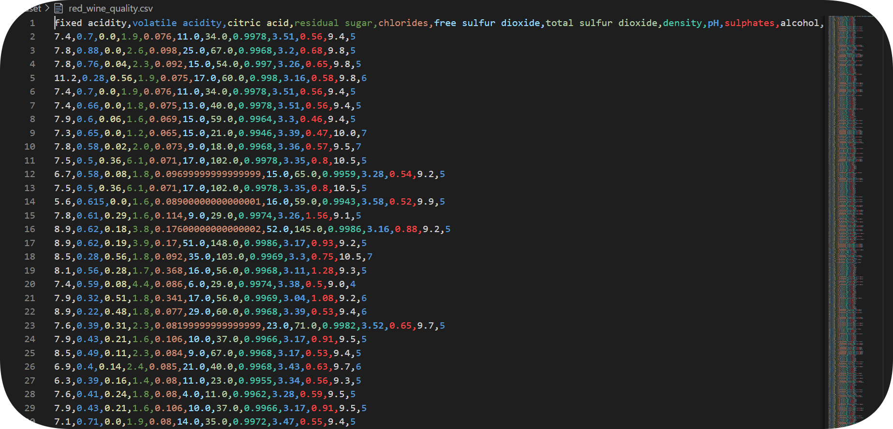
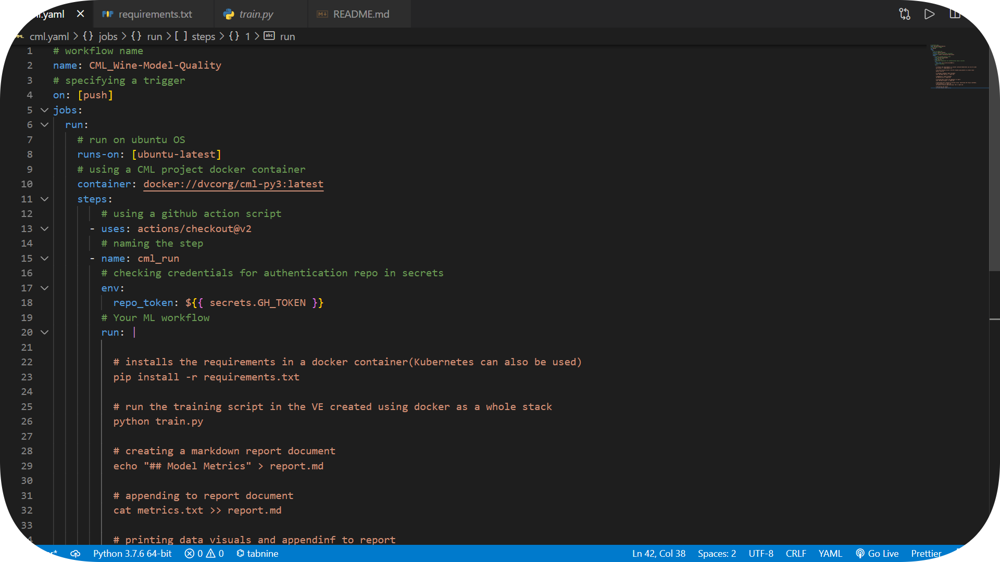

# Continuous Machine Learning 

**What is CML?** Continuous Machine Learning (CML) is an open-source library for
implementing continuous integration & delivery (CI/CD) in machine learning
projects. Use it to automate parts of your development workflow, including model
training and evaluation, comparing ML experiments across your project history,
and monitoring changing datasets.

## Dataset

For this project, I have used the [Red Wine Quality Dataset](https://www.kaggle.com/uciml/red-wine-quality-cortez-et-al-2009) from kaggle. This is a simple and clean practice dataset for regression and classification modelling. It consists of 1600 rows and 12 columns, it's a relatively small dataset, but good enough to under the posterior of this project. *On the side note, I used the [Rainbow CSV extension](https://marketplace.visualstudio.com/items?itemName=mechatroner.rainbow-csv) for VS-code to make .csv files look more attractive 😅*.

## Training Script

⚠️ All the necessary [packages](https://github.com/nakshatrasinghh/CML_RedWineQuality/blob/main/requirements.txt) must be installed using pip in order to train the model. ⚠️ _*Random Forest Regressor was used to build the model. Training and Testing scores were stored in a simple metrics.txt file and feature importances were saved in a .png file.*_ Detailed code of the training script with comments [here](https://github.com/nakshatrasinghh/CML_RedWineQuality/blob/main/train.py).

## Github Actions & Workflows

To use Github actions, you need to create a special .yaml/yml file in .github/workflows/ directory. This define the workflow of the project we want to specify when a particular trigger takes place. _In this case, a **[push]** in the repository _(irrespective of the branch) triggers the workflow._ Detailed code of the workflow with comments [here](https://github.com/nakshatrasinghh/CML_RedWineQuality/blob/main/.github/workflows/cifml.yml)

⚠️ **NOTE**: Make sure to create your own GitHub personal access token in the developer settings and name YOUR_SECRET_NAME as GH_TOKEN.⚠️ *_You can name it anything you like, but make sure to change GH_TOKEN on line 18 in [cifml.yml](https://github.com/nakshatrasinghh/CML_RedWineQuality/blob/main/.github/workflows/cifml.yml) with YOUR_SECRET_NAME_.*

An idea which is often hand in hand with continuous integration is using GitFlow. *_And the idea here is that whenever we want to experiment our project by adding something to our project, changing the parameters, or any thing as such. We're going to create a new branch in Git, and have the developement occur on that new branch._* And then ultimately can merge it into the main branch of our project.

## Pull Requests

Propose the new changes in a new branch or an exisiting branch (except main), create a pull request in that branch.

